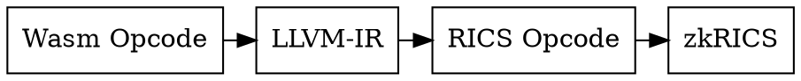
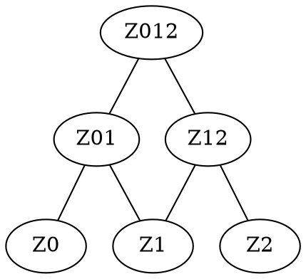

# ZK-WASM with Nova

**NOTE: Current live version is here https://hackmd.io/0bcDwP5QQp-eiAMVEulH7Q - this README/repo will updated with it once it is more stable**

**Goal**: Understand feasibility of a (Super)-Nova based ZK VM such as ZK-WASM or ZK-LLVM. Specifically, understanding if a significant speed up(x10-x100+) is possible vs existing ZK-EVM architecture, and if there's a competitive advantage vs e.g. FRI-based approaches.

Example use cases include arbitrary computation in a browser setting and restricted memory environments, and to do so in a short time frame.

## Current direction

We are looking for a way in which [Nova](https://eprint.iacr.org/2021/370) and/or [SuperNova](https://eprint.iacr.org/2022/1758.pdf) schemes can allow us to have:
- Lower memory (RAM) consumption for the prover (see costs of Scroll or Polygon ZKEVM prover implementations).
- No lookups nor any permutation argument nor anything that gets limited due to the amount of roots of unity of the curve you're using.
- We want the scheme to be significantly different than the Scroll/PSE one. So instead of splitting into general and big-purpose circuits, we would like to be able to have microopcode-style approaches or similar.
- We also want the solution to be scalable and highly-parallelizable. So that the previously mentioned microopcode-style circuits can be proved in parallel with different instances.
- We want the parallel proving instances to not need to have any communication nor interaction while still ensuring consistent memory treatment as well as consistent opcode execution order.

**Note:** A zk-RICS-V can be the target machine opcode that we are looking for.
- LLVM is support RICS-V instruction set and it's an open standard
- The instruction set of RICS-V is big enough to prevent overhead in transpiler from Wasm opcode to RICS opcode
- There is an implement of zkRICS https://github.com/risc0

## Open questions

1. Parallelization of operations that touch global memory
    - Potentially doable with merkle tree and proving state transition of $Z_0-Z_1, Z_1-Z_2 \text{ then } [Z_0,Z_1]-[Z_1,Z_2]$

2. Which compiler IR most interesting and feasible to experiment with?
    - LLVM more modular and better tooling
    - Emscripten compiler complex?
    - Emscripten with WASM more relevant for end-user
    - Emscripten+LLVM will take a while (?)
    - Possible approach is to do basic WASM open code first, before going down IR

3. What is a good minimal example for an initial PoC?
    - Add and mul wasm circuit to show parallelization (R1CS-based)

4. Memory consistency
    - hash memory pages
    - KZG commitment and do pairing check at end
 
## Desired outcome for ZK residency

1. Understanding of feasibility of approach that would justify 2y investment. For this we need to figure out:
    - Parallelization in instruction/code logic blocks for each IVC instance we are folding is possible and there's no big dominant factors.
    - We can tie the memory management (memory ops ordering + memory&stack state) across IVC parallel instances without requiring them to communicate or wait on each other.
    - We don't want to use Binary trees and commit to the leaves ad that forces us to have opening checks inside the folding circuits. Instead, we want to be able to commit to memory&stack with homomorphic commitments and we want to aggregate them using [Tomescu et. al.](https://eprint.iacr.org/2020/527)
2. There's a lot of performance to be gained from parallelization. But the first thing required is to be able to **build a PoC with 2 WASM opcodes and a self-crafted execution trace** where we demonstrate using the [Nova Rust implementation](https://github.com/microsoft/Nova) and some easy R1CS circuits built with [Bellman](https://github.com/zkcrypto/bellman)
3. If all things mentioned above are done. It would be awesome that in the writeup for the end of the residency we also talk about future optimizations discussed (LLVM-IR, EMScripten-IR) etc..

## Misc notes

- Recursion overhead is worth it if the number of constraints for each SNARK inside of the folding step is $\thickapprox$ 2x bigger than the cost of verifying the hash of the commitments that we carry over during the folding process. 

- This cost should be equivalent to the cost of a Poseidon hash verification which we roughly estimate to aproximately 10.000 constraints.

## Relevant links

- Nova (paper): https://eprint.iacr.org/2021/370.pdf
- Supernova (paper): https://eprint.iacr.org/2022/1758.pdf
- Nova (code): https://github.com/microsoft/Nova
- Nova Scotia (code, Circom->Nova): https://github.com/nalinbhardwaj/Nova-Scotia
- KZG commitments explanation: https://dankradfeist.de/ethereum/2020/06/16/kate-polynomial-commitments.html
- Estimation real costs for R1CS circuits for MSM: https://github.com/personaelabs/spartan-ecdsa
