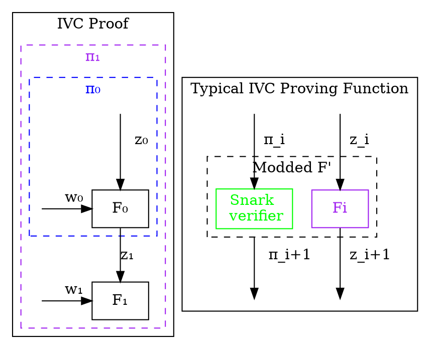
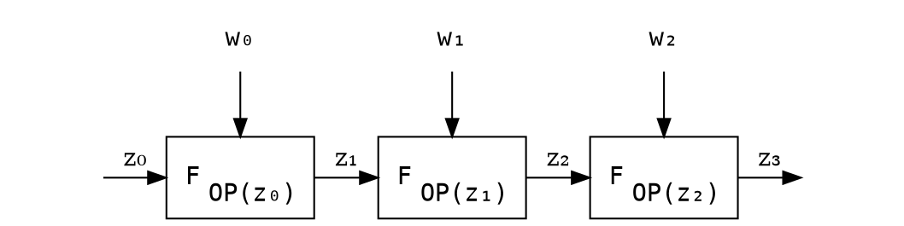
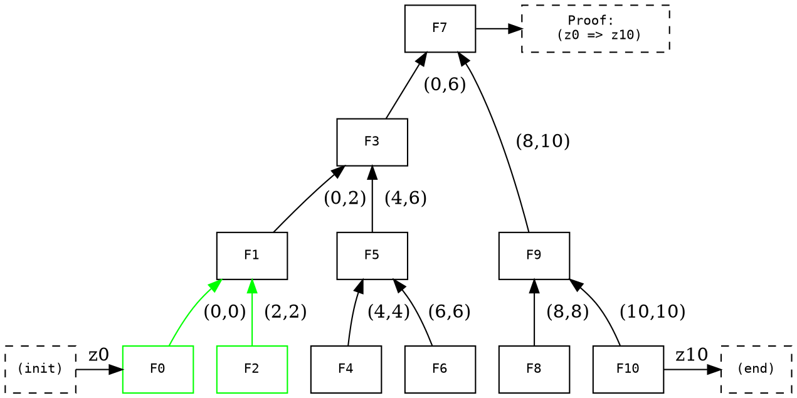
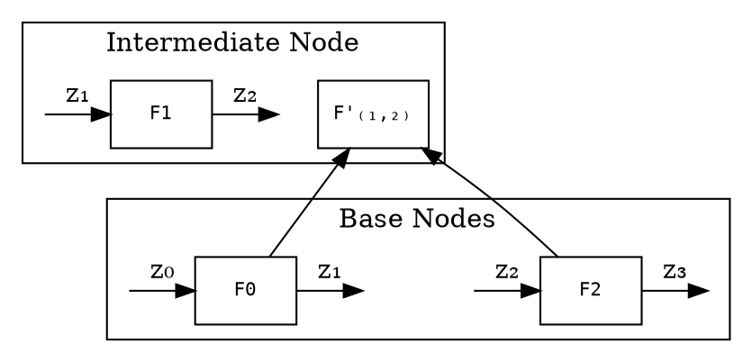
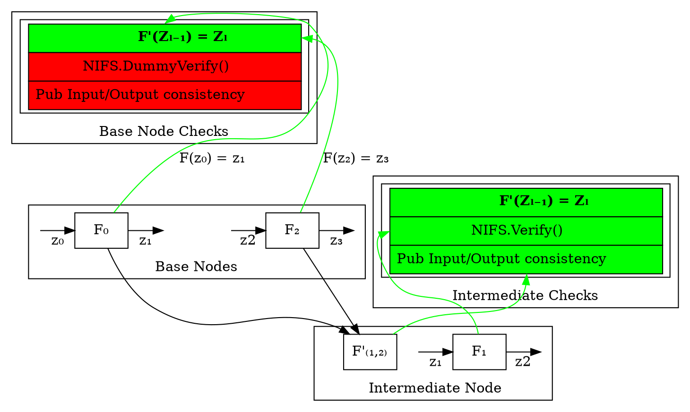
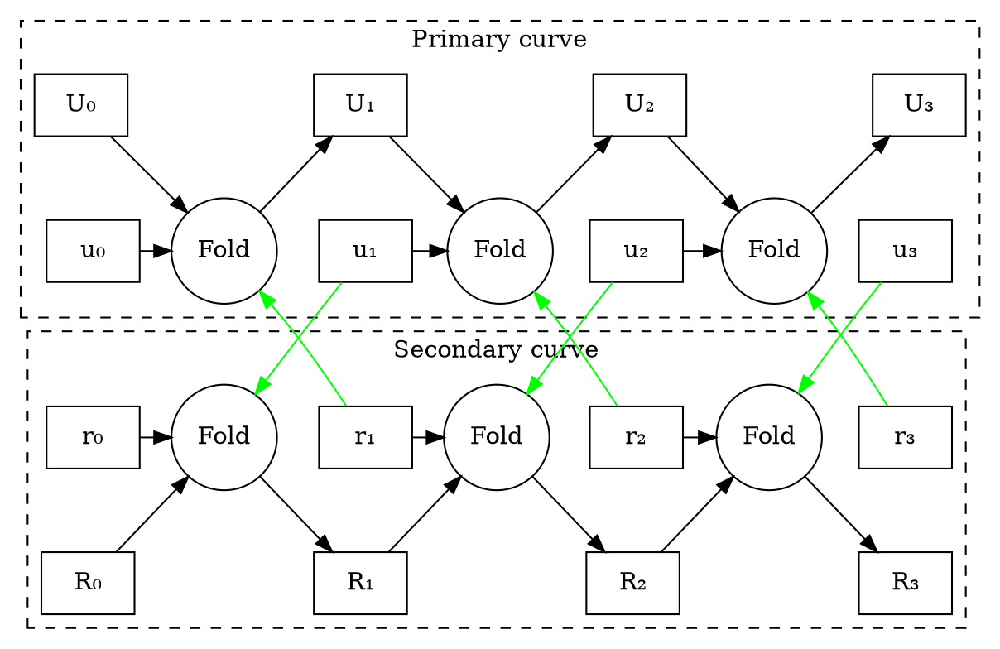
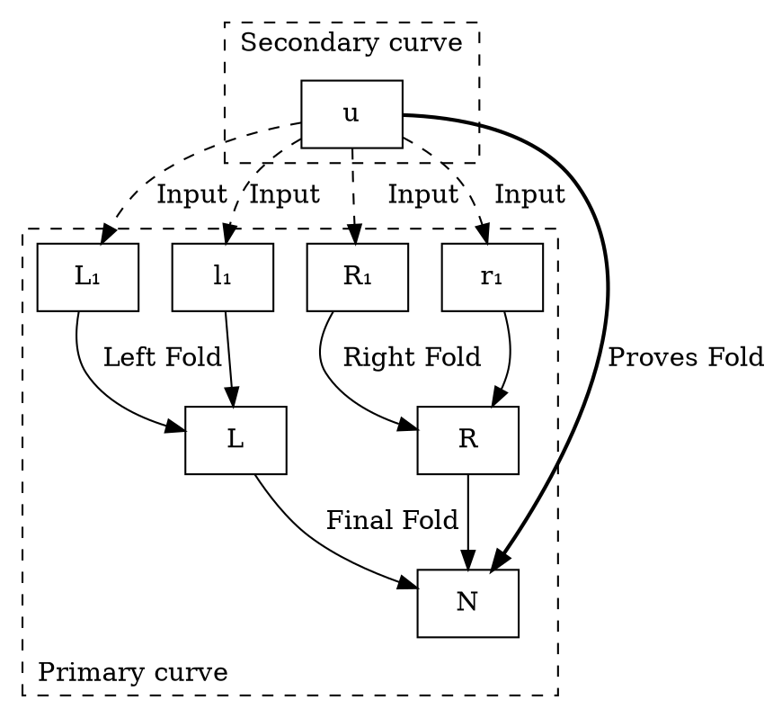

# Nova-based ZKVM spec

*Live version here: https://hackmd.io/0bcDwP5QQp-eiAMVEulH7Q?both=*

## Abstract

We propose a ZKVM based on Nova/SuperNova. Nova allows us execute repetitive blocks of code more efficiently using Incrementally Verifiable Computation (IVC) and a so called *folding scheme*. SuperNova generalizes this to work on different blocks of code using Non-uniform IVC (NIVC). This fits well with the instruction set in a VM. Both Nova and Supernova allows us to parallelize significant parts of the computation and also doesn't require FFTs. Taken together, this suggests there should be significantly faster proving time, and lower memory usage.

By mapping Intermediate Representation (IR) and its opcodes to individual IVC steps, we can prove execution of small blocks of repetitive code more efficiently. This leverages existing compiler infrastructure and hot-path optimizations. We propose a design that deals with VM state updates using vector commitments. Each computation step can be folded up in a binary tree that is amendable to be parallelization. The final fold ensures the integrity of the entire computation, and is wrapped up in a SNARK at the very end to achieve succinctness.

This work can be applied to both to proving ZK-WASM and ZK-LLVM execution and we sketch out what this looks like, as well as give an example of a toy VM.

The proposed architecture is especially interesting for unbounded computation execution proving (unlike the EVM with gas) due to not having the same limits around roots of unity and memory consumption, such as in Halo2.

## Background

*This section gives relevant background for the reader that isn't specific to our ZKVM design.*

### Incrementally Verifiable Computation (IVC)

*This section gives relevant background on the notion of IVCs.*



Incrementally Verifiable Computation (IVC) is the repeated application of some step function $F$ on some public state $z_i$ with some extra witness input $W_i$ at each step. IVC defines proofs $\pi_i$ at each step that proves the execution of the first $i$ steps. That is, $\pi_i$ proves that $F^i(z_0) = z_i$.

Normally, SNARKs are used to construct $\pi_i$ incrementally [xx].

### Nova

*This section gives relevant background from the Nova paper.*

```graphviz
digraph ivc {
    node [shape=box];
    newrank=true;
    compound=true;

    subgraph cluster_proof {
        label="Claims that F'(z_i) = z_i+1"
        zi [style=invis]
        ui [label="Claim \n F'(z_i-1) = z_i"]
        Ui [label="Claim \n F'(z_0, i) = z_i"]
        subgraph cluster_outer_proof {
            label="Modded F'"
            style=dashed;
            F [ color=purple, fontcolor = purple]
            snark [label="Folding \n Scheme", rank=2, color=green, fontcolor = green] 
        }
        zi -> F [label= "  z_i"]
        ui -> snark [label= "  u_i"]
        Ui -> snark [label= "  U_i"]
        
        zi1 [shape=point, style=invis]
        pii1 [label="Claim \n F'(z_0, i+1) = z_i+1"]
        
        snark -> pii1 [label="   U_i+1"]
        F -> zi1 [label="  z_i+1"]
        labelloc="b";
    }
}

Nova uses IVC but replaces the SNARK verifier with a Folding Scheme. By doing this, the recursion overhead is significantly reduced, up to an order of magintude or more.

With Nova, the prover at each step only has to do `O(C)` MSM (Multi Scalar Multiplications). We can compare this with Halo, where the work done at each step is `O(C)` FFT and `O(C)` EXP (Exponentiations in a cryptographic group). C is the size of the circuit.

In practice, the recursion overhead is on the order of ~10 000 constraints. This means that if we have more constraints than that for a given function, it is worthwhile to fold it.

See section below on how paralleization of Nova can be achieved.

### SuperNova

*This section gives relevant background from the SuperNova paper.*


**TODO: Computer generated graph**

Supernova generalizes Nova by allowing for Non-Uniform IVC. This means that we can have different functions being run at each step.

Naively, NIVC can be achieved with Nova where you bundle together functions and have a switch function. However, this means the circuit for each step is $O(C \cdot L)$, where C is the number of constraints for a function, and L is the number of distinct functions.

With SuperNova, we maintain L running instances in parallel, one for each function, and fold the current steps's proofs to the relevant function.

## Overview

*In this section we give an overview of the approach taken.*

A VM is made up of a set of instructions executed sequentially together with some state (memory/stack). Each opcode in this VM corresponds to a step in the IVC. We use SuperNova to more efficiently leverage different opcodes. We also parallelize the proving of each step. Memory state changes is dealt with as public input and output to each step change, and is done with vector commitments (other designs are also possible).

### SuperNova VM

With SuperNova we have multiple different functions run at each step. THis maps very nicely to opcodes in a VM.

In the context of a VM with N instructions, the prover work is reduced from $O(N \cdot C \cdot L)$ to $O(N \cdot (C + L))$, which is quite significant. For any reasonable $C>>L$, it also means we don't have to be too concerned with the number of opcodes.

For example, EVM is on the order of ~100 opcodes WASM is on the order of ~400 opcodes. We can safely assume $C$ is much larger than that, so the prover time becomes $O(N \cdot C)$ where C is the average number of constraints per opcode.

### Parallelizing Nova

*In this section we show how Nova can be parallelized.*

To parallelize Nova, we construct a binary tree of computations, where each node executes one step. At the root of the tree, we get claim that all computations have been executed correcly in the correct order.

Since the required computation at each node can be done without knowledge of the other nodes state, we can parallelize this.


```graphviz
digraph hierarchy {
    node [fontname=Monospace,fontsize=10,shape=box]
    "F3" -> {"F1"} [dir=back, label=" (0,2)"];
    "F3" -> {"F5"} [dir=back, label="  (4,6)"];
    "F7" -> {"F9"} [dir=back, label=" (8,10)"];
    "F7" -> {"F3"} [dir=back, label="  (0,6)"];
    "F1" -> {"F0"} [dir=back,color="green", label=" (0,0)"];
    "F1" -> {"F2"} [dir=back,color="green", label="  (2,2)"];
    "F5" -> {"F4"} [dir=back, label="  (4,4)"];
    "F5" -> {"F6"} [dir=back, label = " (6,6)"];
    "F9" -> {"F8"} [dir=back, label="  (8,8)"];
    "F9" -> {"F10"} [dir=back, label="  (10,10)"];
    
    F0 [label="F0", color="green"];
    F2 [label="F2", color="green"];
    F4 [label="F4"];
    F6 [label="F6"];
    F8 [label="F8"];
    F10 [label="F10"];
    "(init)" [style=dashed];
    "(end)" [style=dashed];
    
    "proof" [dir=blue, style=dashed, label="Proof: \n   (z0 => z10)  "];
    
    {
        rank=same;
        F7 -> "proof"
    }
    
    {
    rank=same;
    "(init)" -> "F0" [label="z0"];
    "F10" -> "(end)" [label="z10"];
    "F8"
    }
}
```

Nova uses IVC but replaces the SNARK verifier with a Folding Scheme. By doing this, the recursion overhead is significantly reduced, up to an order of magintude or more.

With Nova, the prover at each step only has to do `O(C)` MSM (Multi Scalar Multiplications). We can compare this with Halo, where the work done at each step is `O(C)` FFT and `O(C)` EXP (Exponentiations in a cryptographic group). C is the size of the circuit.

In practice, the recursion overhead is on the order of ~10 000 constraints. This means that if we have more constraints than that for a given function, it is worthwhile to fold it.

See section below on how paralleization of Nova can be achieved.

### SuperNova

*This section gives relevant background from the SuperNova paper.*




Supernova generalizes Nova by allowing for Non-Uniform IVC. This means that we can have different functions being run at each step.

Naively, NIVC can be achieved with Nova where you bundle together functions and have a switch function. However, this means the circuit for each step is $O(C \cdot L)$, where C is the number of constraints for a function, and L is the number of distinct functions.

With SuperNova, we maintain L running instances in parallel, one for each function, and fold the current steps's proofs to the relevant function.

## Overview

*In this section we give an overview of the approach taken.*

A VM is made up of a set of instructions executed sequentially together with some state (memory/stack). Each opcode in this VM corresponds to a step in the IVC. We use SuperNova to more efficiently leverage different opcodes. We also parallelize the proving of each step. Memory state changes is dealt with as public input and output to each step change, and is done with vector commitments (other designs are also possible).

### SuperNova VM

With SuperNova we have multiple different functions run at each step. THis maps very nicely to opcodes in a VM.

In the context of a VM with N instructions, the prover work is reduced from $O(N \cdot C \cdot L)$ to $O(N \cdot (C + L))$, which is quite significant. For any reasonable $C>>L$, it also means we don't have to be too concerned with the number of opcodes.

For example, EVM is on the order of ~100 opcodes WASM is on the order of ~400 opcodes. We can safely assume $C$ is much larger than that, so the prover time becomes $O(N \cdot C)$ where C is the average number of constraints per opcode.

### Parallelizing Nova

*In this section we show how Nova can be parallelized.*

To parallelize Nova, we construct a binary tree of computations, where each node executes one step. At the root of the tree, we get claim that all computations have been executed correcly in the correct order.

Since the required computation at each node can be done without knowledge of the other nodes state, we can parallelize this.




In the above illustration we see how computation is folded upwards. More generally, $F'(L,R)$ represents a claim that steps L through R have been executed correctly. This claim is a commitment.

As a base case, we have $F(L,L)$, where $F(Z_{L-1}) = Z_L$, as per the original Nova paper. $Z_i$ represents the public input and output.

#### Base and Internal Nodes

In the above diagam, we have two types of nodes, base layer nodes and internal/intermediate nodes.

Base layer nodes only prove the execution trace. Each of them proves  a state change dependant on the F instance we apply.

Internal nodes also prove a correct step change. But in addition, they prove the correct chaining of the previous output being equal to the actual input. They also take care of proving the correct folding performed in downstream instances.

We can see this in more detail below:



Here we can see the two different cases that we can have in Nova. We have a base layer, which requires us to provide witness for as well as represent the entire execution trace ($F$ boxes above).

Above, we see the intermediate levels (which keeps going until the top). These prove a correct execution of $F$ and take care of the public input/output consistency of the folds as well as doing the `NIFS.Verify` step.

To understand how folding works in Nova in more detail, let's look at the required checks and how it works in each case.

#### Required Checks



We can see above the distinction between the things we have to check for base nodes and internal nodes, respectively. Green indicates that it is a check we perform and red that we don't perform it. We include both checks we do and don't do to make the recursion easier to write and reason about.

#### Base Nodes

For base nodes, we just prove that if we apply `F` to the input we get the expected output. That is, we prove that given a set of public inputs we get a set of public outputs that is pushed forward to the next `F` instance.

To do so, we create an `F'` instance which verifies a dummy-initialized and agreed-upon (between the prover and the verifier) folding instance (the `NIFS.Verify()` step).

:::warning
We aren't actually verifying any previous folds here. We are just combining the initial dummy fold with our `F'` instance.
:::

Finally, we need to ensure public input-output consistency. This step is not needed as we're on the base layer and there's no initial inputs/outputs on what we need to agree with for our `F'` instance validation.

:::info
At the end of this, we simply:

- Generate a set of Relaxed R1CS constraints that are accumulated into a matrix of the freshly-generated instance (this involves an error term computation and math-related folding ops). These are the constraints that prove our actual relation $F'(z_{L}) = z_{R}$ holds. **Notice the relation is not verified to hold. Rather, we only accumulate them be checked at the end of all the foldings.**
- Do dummy checks for the previous folding verification.
- Do dummy checks for the input/output consistency checks.

Note that we include the dummy checks too as we want all the $F'$ instances to be of the same shape.
:::

#### Intermediate Nodes

In the case of intermediate nodes, the story is completely different.

In this case, we have both inputs for an F and pair of Relaxed R1CS instances which claim to satisfy a pair of previously folded $F'$ instances which are one computational step apart.

As seen in the above figure, the purpose of the intermediate nodes is to:

- Enforce correctness of Public Input/Output consistency. I.e.: checking that `F(left.out) = F(right.in)`
- Verify a previous fold of F' nodes (NIFS).

#### Parallelization

To summarize, we parallelize Nova by using a binary tree structure for computation. We compute incremental proofs of a single step, and then fold "upwards". That is, step `1-2` and step `3-4` turns into proving transition from step `[1-2]` to step `[3-4]`.

At the very top of the tree, we guarantee the integrity of the computation and that all state transitions happened correctly.

See [Nova (PSE fork)](https://github.com/privacy-scaling-explorations/nova) for an experimental implementation of parallel Nova.

Also see appendix for a sketch of a distributed prover architecture.

### Curve Cycling

In the previous section we described how an F' would verify a folding step on each new step in our proof. However this sketch misses a key detail: because the base field is not equal to the elliptic curve field the constraints to do this naively would be quite expensive. To get around this we run two chains of folded proofs together and use an elliptic curve cycle where the verification of the elliptic curve operations of one curve are cheap to verify in the base field of the other and vice versa. This adds to the recursive overhead of at least the size of the F' circuit and proving time for an extra fold to each step of the sequential prover.

We use this curve cycling in practice for the sequential case by initalizing two relaxed and two normal R1CS instances. The algorithm for moving forward one step in the proof is as follows:

1. Fold the relaxed and normal R1CS instance from the previous step on the secondary curve. 
2. Construct a new R1CS instance of F' for the primary circuit in the first curve, and take as input to it's F' folding verifier the data of the fold from the first step in the other curve. This new R1CS claims both the correct execution of the F constraints and the folding of the instances from the second curve.
3. Fold the new R1CS from step 2 with the input relaxed R1CS on the primary curve.
4. Produce a proof of the secondary R1CS and give as input to its F' verifier the folding data from step 3. This R1CS instance claims the correctness of the primary curve folding and the F circuit on the secondary curve.
5. Output the folding result from step 1, the new claimed R1CS from step 2, the folding result from step 3 and the new claimed R1CS from step 4 as your new set of a pair of Relaxed and normal R1CS instances from each curve.

At the end you will have a Nova proof of the folding validity of the other curve's Nova sequence and this curve's circuit invoked $n$ times, for each curve. They must be proven and verified together to be valid as each curve's Nova instance check's the other curve's Nova instance.

- The following graph shows the relationships between the R1CS instances. The black lines are folding relationships, the green lines are verification relationship, the capital variable are relaxed R1CS and the lowercase are R1CS.




#### Curve Cycling in a Parallel World

Direct application of the system for constructing Nova by curve cycling from the previous proof to the parallel case will fail. This is because the F' for the sequential case is designed to only accumulate 1 relaxed R1CS with 1 normal R1CS. In the parallel case each node in our tree has both a relaxed R1CS instance claiming the validity of node proofs below via folding and a new R1CS claiming the next invokation of F'. In order to reduce these four claims to one we implemented a naive proof of concept which folds 2 relaxed and 2 normal R1CS instances to one relaxed instance, and an F' which verifies this quad fold. Our naive implementation reuses as much of Microsoft's Nova's lib as possible as so is implemented as 3 foldings of 2 instances. This is likely much less efficient than implementing this as a new higher degree folding protocol.

We give a diagram of this where we create a new $u$ which is an R1CS claim that the left and right nodes of a tree fold to a new relaxed R1CS claim $N$:




### Parallelizing SuperNova

When we speak about SuperNova parallelization, things can get quite complicated.

The main thing to consider is that SuperNova is designed to support VM execution trace proving. That means that for each set of opcodes, we need to support each one of them in each fold (we don't know which opcode will be digested on each fold). Rephrasing, we don't know which will be the next folded opcode on the next $F'$ instance.

Now, each fold will contain as many $F'$ instances as opcodes we have avaliable.

It is already well known how to support multiple opcodes within Nova-style folds. The unknown is mostly how to guarantee memory, execution-order and stack consistency across folds in SuperNova. Especially in the parallel case. 

We sketch a design proposal for that, which solves the issues at a pretty affordable cost within R1CS (could be improved using a Plonkish-style arithmetization). See the section below.

### State updates using vector commitments

The idea is to commit to the memory state of the VM before and after the $F'$ execution. So that we can open all the positions we want and prove inside of the R1CS that they're equivalent to our witness values which with we will operate then.

One challenge with a VM is that you need to make sure your memory is consistent.

With vector commitments we have the following operations:
- Open(Com, Idx) = Value
- Edit(Com, Idx, NewValue) = NewCommitment

Remember that a vector commitment commits to a vector $a_0,…,a_{n−1}$ and lets you prove that you committed to $a_i$ for some $i$. We can reproduce this using the Kate commitment scheme: Let $p(X)$ be the polynomial that for all $i$ evaluates as $p(i)=a_i$.
:::info
This completely matches the behaviour we need where we will commit to all the Memory positions for example, and we need to prove inside of the circuit that we are providing the witnesses that satisfy the openings at particular places of the memory.
:::
As per [KZG commitments](https://dankradfeist.de/ethereum/2020/06/16/kate-polynomial-commitments.html) We know there is such a polynomial, and we can for example compute it using Lagrange interpolation: 
$$
\sum_{n=0}^{n=i_{max}}Mem_i \prod_{n=0}^{n=i_{max}} {X-j\over n-j}
$$

#### MUL opcode example

As an example, let's look at the MUL opcode. Let's assume we have commitments to all the Memory and Stack positions such that:

$$
C_M = \sum_{i=Mem(0)}^{i=Mem(MAX)}Mem_i \prod_{j=0\\j \neq i}^{j=MaxMemPos} {X-j\over i-j} \\
C_S = \sum_{i=Stack(0)}^{i=Stack(MAX)}Stack_i \prod_{j=0\\j \neq i}^{j=MaxStackPos} {X-j\over i-j} 
$$

Therefore:

$$
\mathbb{Opcode}_{MUL} \gets a \times b = c
$$

We first fetch $a$, $b$ and $c$ from memory. To do so, we prove the correct openings of them against $C_M$. **Note that $c$ is obtained from the commitment of the memory at the end of the step ($C_{M+1}$)**

$$
Fetch(Mem(idx_a)) \gets \mathbb O(C_M, idx_a) = a\\
Fetch(Mem(idx_b)) \gets \mathbb O(C_M, idx_b) = b\\
Set(Mem(idx_{c+1})) \gets \mathbb E(C_{M+1}, c_{+1}, idx_{c+1})\\
$$

We now check the Stack consistency by checking that $a$, $b$ and $c$ are at the correct positions in the Stack at the end.

$$
Set(Stack(a)) \gets \mathbb E(C_{S+1}, a, idx_{a+1})\\
Set(Stack(b)) \gets \mathbb E(C_{S+1}, b, idx_{b+1})\\
Set(Stack(c_{+1})) \gets \mathbb E(C_{S+1}, c_{+1}, idx_{c+1})\\
$$

Now we apply a constraint in R1CS which checks the correctness of the MUL execution.

$$
R1CS(a \times b = c_{+1})
$$

:::success
Note that we have just proven the correctness of the memory handling for one Opcode. This has 2 important considerations:
- The folds require that the `Public Inputs` of the current fold are the `Public Outputs` of the previous one. In that way, at the very top of the aggregation/folding tree we are sure all the memory is consistent.
- We can account for program counter correctness too with this technique. And indeed most of the things we have been able to imagine related to VM execution traces.
:::

*See appendix for more details on how to handle memory.*


## Applications

With the above architecture, a lot of the problems that we expect to see are essentially compiler problems. This means we can leverage existing techniques, such as hot-path optimization etc to our benefit. This is a well known problem, and there's a lot of literature and tools around this that can be leveraged.

In this document, we focus on a toy VM, but the general architecture can be used in any general-purpose VM, and this was indeed one of the motivations behind the Nova and SuperNova paper.

### Unbounded computation

Notice that unlike in the ZKEVM, there's no concept of `Gas` for ZKWASM or any VM in general.

That means that proving systems like Halo2 or Groth16 can have a hard time expressing VM execution traces due to the fact that they're limited by the amount of roots of unity they have on their underlying curves.

While recursion could be a solution for this, but then there are chalenges on how to properly partition the execution trace. There are also limitations that plonkish-style proving systems have when there are a lot of columns or rows, which is that aggregation is slow.

### Toy VM

A simple toy VM which includes ADD and MUL instructions, together with memory and program counter can be constructed. This gives intuition for the general approach and also touches relevant aspects (dealing with memory and overhead for it, multiple opcodes, execution trace).

See section below for a WASM-based execution trace that includes this.

### zk-WASM

zk-WASM is interesting because WASM is more general-purpose than e.g. EVM. This opens the door for a lot of developers to do private and verifiable computation.

For example, a user may want to prove the WASM execution of having access to some website in the browser, or prove that their sqlite db contains some entry.

We can modify Emscripten to prove correct execution of the intermediate representation. In the appendix we illustrate how we can extract the execution trace from WASMthe WebAssembly runtime.

### zk-LLVM

Similarly to WASM, LLVM uses a modular architecture and it is possible to add new backends and optimizations to LLVM. Using the suggested architecture essentially turns the problem into a compiler optimization problem.

Note that because of how SuperNova works, we can add extra opcodes without significant overhead.

### zk-RISC-V

RISC-V is an open standard instruction set architecture based on established RISC principles. Unlike most other ISA designs, RISC-V is provided under open source licenses that do not require fees to use.

There are some advantages of zk-RISC-V to be a good candidate for zkVM.
- Support by almost compiler as a target machine
- Open standard & free to use
- Wasm opcode can be traspliered to RISC's opcode
- The instruction set is standardized and it isn't too complex

## Appendix

### Security considerations

#### Cryptographic Assumptions

Nova assumes DLOG hardness and RO (Random Oracle).

#### Zero Knowledge Privacy

While privacy has not been a focus of this architecture, we can naively and trivially re-introduce it by performing a zk-SNARK for each folding step. However, this is likely to be very inefficent. We can also replace the Spartan compression proof with one that is ZK. This has the downside that the prover of the IVC cannot be shared.

To enable zero-knowledge privacy more efficiently requires further research.

### Performance and benchmarks

*The following section includes some preliminary benchmarks*

See current list of benchmarks [here](https://hackmd.io/0gVClQ9IQiSXHYAK0Up9hg?both=). This document also contains some pointers for how to write performant circuits.

### Distributed Nova Prover sketch

See [here](https://hackmd.io/LIj43jK_QCSQETkjMkJISg?view=) for how a distributed Nova prover might look like and what kind of performance we can expect.

### Extracting Execution Trace from WebAssembly Runtime

To prove arbitrary computation we need to extract the execution trace and prove that every step of the computation is correct.

See [here](https://hackmd.io/NTc2i5XIQQG9b0CNBpcZVA) for extracting the execution trace of the WebAssembly runtime.

### Handling The Memory of zkVM

See [proposal](https://hackmd.io/vF1jobzsRoubyUASqQG0Zw?view=) on how to deal with memory trace using KZG commitments, verkle trees and vector commitments.

### Things to improve in this spec

Non-exhaustive list of thing that should be added to this spec:

- Elaborate more on folding scheme incl `NIFS.Verify` in background
- Elaborate on witness data / private input

## Copyright

Copyright and related rights waived via [CC0](https://creativecommons.org/publicdomain/zero/1.0/).

## References

- Nova (paper): https://eprint.iacr.org/2021/370.pdf
- Supernova (paper): https://eprint.iacr.org/2022/1758.pdf
- Nova (code): https://github.com/microsoft/Nova
- Nova Scotia (code, Circom->Nova): https://github.com/nalinbhardwaj/Nova-Scotia
- Recursive zkSNARKs: https://0xparc.org/blog/groth16-recursion
- KZG explanation: https://dankradfeist.de/ethereum/2020/06/16/kate-polynomial-commitments.html
- Curve cycling: https://zcash.github.io/halo2/background/curves.html#cycles-of-curves
